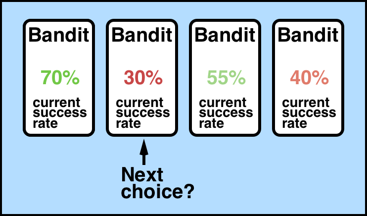
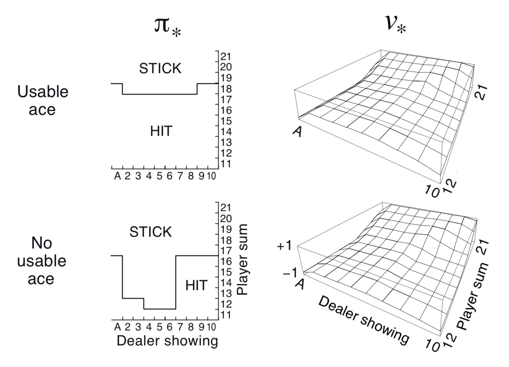

# LearningX Examples & Tutorials

We provide here a suite of self-contained Python examples that introduce you to concepts in:

* Classical & Deep Reinforcement Learning 

* Basic & Advanced Machine Learning

Usage of the examples involve only running the main file from its project directory, and each example has its own README.md file discussing the theory and applications.

## Classical Reinforcement Learning
 
### [The Multi-Armed Bandit Problem](https://github.com/ankonzoid/LearningX/tree/master/classical_RL/MAB)

### [Q-Learning on GridWorld](https://github.com/ankonzoid/LearningX/tree/master/classical_RL/gridworld)

### [Optimal Blackjack Strategy](https://github.com/ankonzoid/LearningX/tree/master/classical_RL/blackjack)

## Deep Reinforcement Learning

### [Balancing Cartpole Beam](https://github.com/ankonzoid/LearningX/tree/master/deep_RL/cartpole)

### [Playing Pong from pixels](https://github.com/ankonzoid/LearningX/tree/master/deep_RL/pong)

## Basic Machine Learning

 

### Supervised Classification (`classification` directory)

#### Decision Tree

#### K nearest neighbours

### Supervised Regression (`regression` directory)

#### Linear Regression optimized via Gradient Descent

#### Linear Regression optimized via Stochastic Gradient Descent

#### Logistic Regression optimized via Gradient Descent

### Unsupervised (`unsupervised` directory)

#### K-means clustering

## Advanced Machine Learning

### [Building Model Trees](https://github.com/ankonzoid/ML_algorithms/tree/master/model_tree)

 

### [Tree Ensembles: Bagging and Boosting](https://github.com/ankonzoid/ML_algorithms/tree/master/tree_ensembles)

 

 

### Author

Anson Wong
