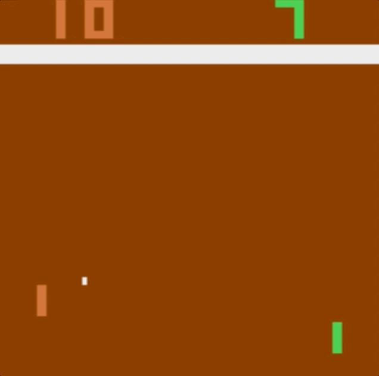
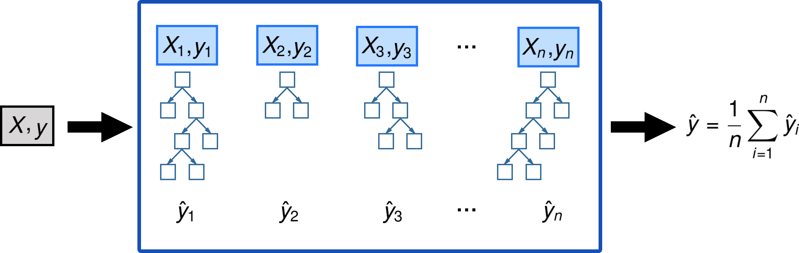
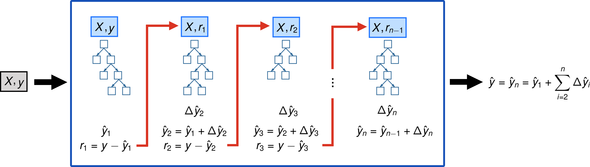

# LearningX Examples and Tutorials

We provide here a suite of Python examples that walk you through concepts in:

* Classical & Deep Reinforcement Learning 

* Basic & Advanced Machine Learning

Usage of the examples is simple: just run the main file for each project. Each project example contains its own `README.md` file discussing the theory and applications.

## Classical Reinforcement Learning
 

### [The Multi-Armed Bandit Problem](classical_RL/MAB)

### [Shortest Path Search in GridWorld (Q-Learning)](classical_RL/gridworld)

### [Optimal Blackjack Strategy](classical_RL/blackjack)

## Deep Reinforcement Learning

### [Balancing Cartpole Beam on OpenAI gym](deep_RL/cartpole)

### [Playing Pong from pixels on OpenAI gym](deep_RL/pong)

## Basic Machine Learning

### Classification

 

* [Decision Tree](basic_ML/classification)

* [K-Nearest Neighbours](basic_ML/classification)

### Regression

 

* [Linear Regression (optimized via Gradient Descent)](basic_ML/regression)

* [Linear Regression (optimized via Stochastic Gradient Descent)](basic_ML/regression)

* [Logistic Regression (optimized via Gradient Descent)](basic_ML/regression)

### Unsupervised

 

* [K-means Clustering](basic_ML/unsupervised)

## Advanced Machine Learning

### [Building Model Trees](advanced_ML/model_tree)

 

### [Tree Ensembles: Bagging and Boosting](advanced_RL/tree_ensembles)

 

 

### Author

Anson Wong
