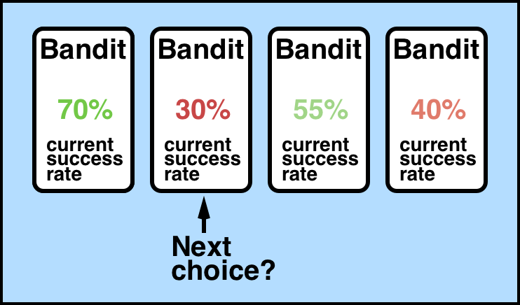
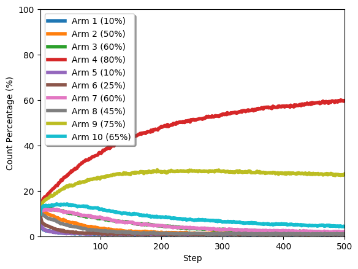

# Solving the Multi-armed Bandit Problem

The multi-armed bandit problem is a classic reinforcement learning example where we are given a slot machine with n arms (bandits) with each arm having its own rigged probability distribution of success. Pulling any one of the arms gives you a stochastic reward of either R=+1 for success, or R=0 for failure. Our objective is to pull the arms one-by-one in sequence such that we maximize our total reward collected in the long run.

<p align="center">

</p>

In this code, we deploy an epsilon-greedy agent to play the multi-armed bandit game for a fixed number of episodes using a well-established classical reinforcement learning method of an epsilon-greedy agent and reward-average sampling to compute the action-values Q(a).

<p align="center">

</p>

<p align="center">

</p>

### Usage:

> python3 multiarmed_bandits.py

In the example provided, we train on 2,000 experiments with 10,000 episodes per experiment. The default exploring parameter is `epsilon = 0.1` and 10 bandits are intialized with success probabilities of `{0.10, 0.50, 0.60, 0.80, 0.10, 0.25, 0.60, 0.45, 0.75, 0.65}`. To run the code, use 

Bandit #4 should be selected as the "best" bandit on average, with bandit #9 running second, and bandit #10 as a far third.

### Example Output

Along with `actions.png` (agent actions) and `rewards.png` (agent collected rewards), you should also get

```
Running multi-armed bandits with N_bandits = 10 and agent epsilon = 0.1
[Experiment 1/100]
  N_episodes = 10000
  bandit choice history = [1 4 4 ... 4 4 4]
  reward history = [0 1 1 ... 1 1 1]
  average reward = 0.7761

...
...
...

[Experiment 100/100]
  N_episodes = 10000
  bandit choice history = [ 2 10  6 ...  4  4  4]
  reward history = [1 0 1 ... 1 1 1]
  average reward = 0.764

reward history avg = [0.51 0.43 0.63 ... 0.79 0.75 0.73]
```

### Libraries required:

* numpy

### Author

Anson Wong
