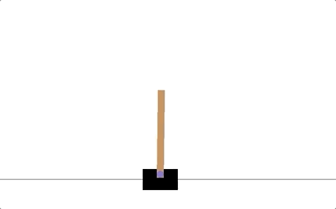

# Cartpole

 Uses a DQN agent to solve the cartpole problem in gym. 

<p align="center">

</p>

The observation vector is of dimension 4, and the action space is of dimension 2 (push cart left or right).

### Usage

> python3 cartpole.py

### Output

```
[episode 0/300] total reward: 11, epsilon: 1.0
[episode 1/300] total reward: 15, epsilon: 1.0
[episode 2/300] total reward: 18, epsilon: 1.0
[episode 3/300] total reward: 20, epsilon: 1.0
[episode 4/300] total reward: 35, epsilon: 1.0
[episode 5/300] total reward: 11, epsilon: 1.0
[episode 6/300] total reward: 9, epsilon: 1.0
[episode 7/300] total reward: 20, epsilon: 1.0
[episode 8/300] total reward: 17, epsilon: 0.98
[episode 9/300] total reward: 14, epsilon: 0.96
[episode 10/300] total reward: 8, epsilon: 0.94
...
...
...
[episode 290/300] total reward: 439, epsilon: 0.01
[episode 291/300] total reward: 499, epsilon: 0.01
[episode 292/300] total reward: 499, epsilon: 0.01
[episode 293/300] total reward: 499, epsilon: 0.01
[episode 294/300] total reward: 490, epsilon: 0.01
[episode 295/300] total reward: 499, epsilon: 0.01
[episode 296/300] total reward: 499, epsilon: 0.01
[episode 297/300] total reward: 499, epsilon: 0.01
[episode 298/300] total reward: 379, epsilon: 0.01
[episode 299/300] total reward: 499, epsilon: 0.01
```
